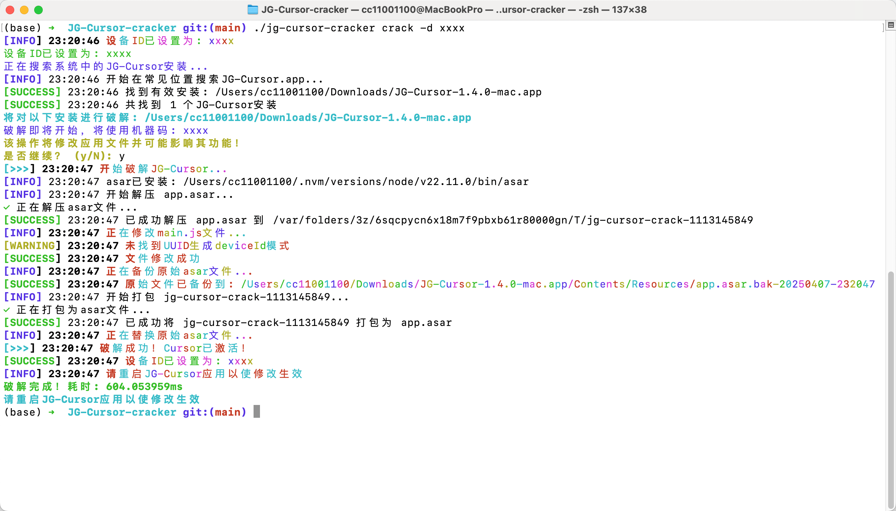

# JG-Cursor-cracker

[](https://github.com/JSREP/JG-Cursor-cracker/actions/workflows/go-test.yml)

JG-Cursor-cracker 是一个用于破解和激活 JG-Cursor 应用的工具。


## 相关资源

- [JG-Cursor 引导文档](https://bwcxynefwek.feishu.cn/docx/XgtZdePyEoarjXxp9eLciNZFnkd) - 包含下载 JG-Cursor 各个平台客户端等信息的引导文档

## 使用演示

下面是工具运行时的截图示例：



## 功能

- 自动搜索硬盘上的 JG-Cursor.app 安装
- 自动安装 asar 工具（优先使用 cnpm）
- 解包和修改 app.asar 文件
- 支持指定自定义机器码
- 炫酷的彩色控制台输出

## 编译与安装

### 环境要求

- Go 1.18 或更高版本
- Node.js 和 npm (用于 asar 工具)

### 从源码编译

1. 克隆仓库：
   ```bash
   git clone https://github.com/JSREP/JG-Cursor-cracker.git
   cd JG-Cursor-cracker
   ```

2. 编译：
   ```bash
   go build -o jg-cursor-cracker
   ```
   
   或者指定主文件：
   ```bash
   go build -o jg-cursor-cracker main.go
   ```

3. 运行测试（可选）：
   ```bash
   go test -v ./pkg/cracker/...
   ```

### 直接下载编译好的二进制文件

访问 [Releases](https://github.com/JSREP/JG-Cursor-cracker/releases) 页面下载对应系统的二进制文件。

对于 MacOS 用户，下载后可能需要添加执行权限：
```bash
chmod +x jg-cursor-cracker
```

## 使用方法

### 基本用法

```bash
# 使用默认设置破解
./jg-cursor-cracker crack

# 使用自定义机器码破解
./jg-cursor-cracker crack --device-id "MY-CUSTOM-ID-12345"

# 指定JG-Cursor安装路径
./jg-cursor-cracker crack --path /Applications/JG-Cursor.app

# 全盘搜索JG-Cursor安装并破解
./jg-cursor-cracker crack --search-disk

# 显示JG-Cursor安装信息
./jg-cursor-cracker info

# 显示版本信息
./jg-cursor-cracker version
```

### 命令说明

- `crack`: 破解JG-Cursor应用
  - `-d, --device-id string`: 自定义机器码
  - `-p, --path string`: JG-Cursor安装路径
  - `-s, --search-disk`: 搜索整个硬盘
  - `-y, --yes`: 自动确认所有提示

- `info`: 显示安装信息
  - `-p, --path string`: JG-Cursor安装路径
  - `-s, --search-disk`: 搜索整个硬盘

- `version`: 显示版本信息

## 持续集成

项目使用 GitHub Actions 进行持续集成，每次代码提交都会自动运行测试。

## 贡献代码

欢迎提交 Pull Request 或 Issue。在提交代码前，请确保所有测试能够通过。 

## 自定义机器码详细步骤

### 为什么需要自定义机器码？

使用自定义机器码可以让你指定一个固定的识别码，这样即使重新安装操作系统或在不同设备上使用，都能保持相同的许可状态。

### 自定义机器码的命令格式

```bash
./jg-cursor-cracker crack -d <自定义机器码>
```

或使用长选项：

```bash
./jg-cursor-cracker crack --device-id <自定义机器码>
```

### 详细操作步骤

1. **下载并编译工具**：
   ```bash
   git clone https://github.com/JSREP/JG-Cursor-cracker.git
   cd JG-Cursor-cracker
   go build -o jg-cursor-cracker
   ```

2. **查看当前 JG-Cursor 安装位置**：
   ```bash
   ./jg-cursor-cracker info
   ```
   工具会自动搜索系统中的 JG-Cursor 安装并显示其路径。

3. **使用自定义机器码破解**：
   ```bash
   ./jg-cursor-cracker crack -d YOUR-CUSTOM-ID-123
   ```
   将 `YOUR-CUSTOM-ID-123` 替换为你想要使用的机器码。机器码可以是任意字符串，建议使用字母、数字和连字符的组合。

4. **确认操作**：
   工具会显示以下信息：
   ```
   将对以下安装进行破解: /path/to/JG-Cursor.app
   破解即将开始，将使用机器码: YOUR-CUSTOM-ID-123
   该操作将修改应用文件并可能影响其功能！
   是否继续？(y/N): 
   ```
   输入 `y` 确认继续。

5. **等待破解完成**：
   工具会执行以下操作：
   - 安装必要的 asar 工具
   - 解包 app.asar 文件
   - 修改设备ID
   - 重新打包 app.asar 文件
   - 替换原始文件（自动备份）

6. **重启 JG-Cursor 应用**：
   ```bash
   pkill -f JG-Cursor  # 关闭应用
   open /path/to/JG-Cursor.app  # 重新打开应用
   ```
   将 `/path/to/JG-Cursor.app` 替换为实际的安装路径。

### 注意事项

- 机器码长度建议不要超过32个字符
- 避免使用特殊字符，仅使用字母、数字和连字符
- 每次破解都会备份原始 app.asar 文件，格式为 `app.asar.bak-YYYYMMDD-HHMMSS`
- 如果破解后应用无法正常工作，可以恢复备份文件

### 自动确认所有提示

如果你想跳过确认提示，可以使用 `-y` 或 `--yes` 选项：

```bash
./jg-cursor-cracker crack -d YOUR-CUSTOM-ID-123 -y
```

### 同时指定安装路径

如果有多个 JG-Cursor 安装，或者安装在非标准位置，可以同时指定路径：

```bash
./jg-cursor-cracker crack -d YOUR-CUSTOM-ID-123 -p /path/to/JG-Cursor.app
``` 